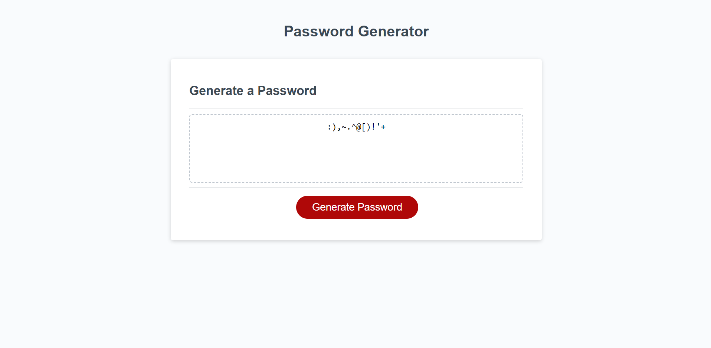

# Password-Generator
Using JavaScript logic to create a functioning password generator

# Description

I have been given a starter code with functions and arrays with special, numeric, upper case and lower case characters.
Using the starter code, I have used logic to manipulate it to do the following:

- Add a prompt to allow user to give a length of how long the password is
- Given options of whether they'd want special, numeric, upper case and lower case characters in the password (added an alert if they choose none)
- Put arrays together and randomise the characters to the length specified
- Show on screen the generated password for the user to use.

Please check the index.js to see the source code
Please check the Deployed Application (https://saycatnab.github.io/Password-Generator/) to see the console.

# Screenshots

This is how the Financial Analysis looks in the console

# Link to Deployed Application

https://saycatnab.github.io/Password-Generator/

